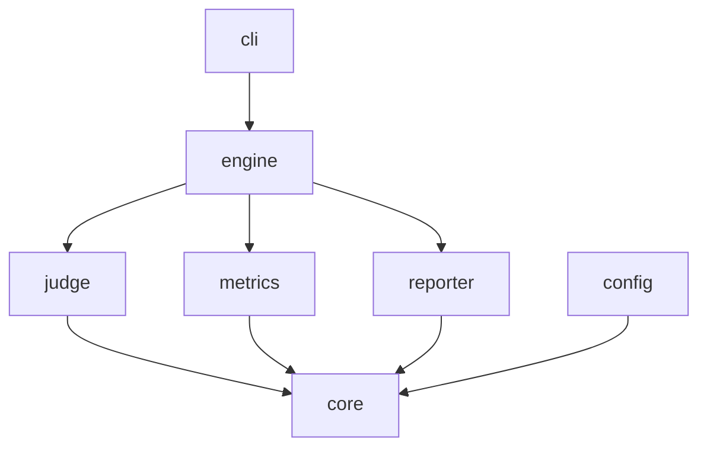

# DeadOrEval

> Is your chatbot dead or alive? Find out with one command.

DeadOrEval is a local-first LLM evaluation framework for testing chatbots and AI agents.
No API keys. No cloud. No cost. Just point it at your chatbot and get a reliability report.

## Why DeadOrEval?

Most eval tools measure **capability** — can your model pass a benchmark?
DeadOrEval measures **reliability** — can you trust it in production on week 12?

## How it works

1. You provide a context, a question, and a chatbot answer
2. DeadOrEval sends it to a local judge model thousands of times
3. You get a report showing consistency, accuracy and failure rate

## Contributing

Please read [BRANCHING.md](BRANCHING.md) for details on our branching strategy and contribution rules.

For detailed documentation on each module, see the README in each module directory:

- [core/README.md](core/README.md) — Domain models and interfaces
- [judge/README.md](judge/README.md) — Judge implementations
- [metrics/README.md](metrics/README.md) — Metric implementations
- [engine/README.md](engine/README.md) — Evaluation engine
- [reporter/README.md](reporter/README.md) — Report generation
- [config/README.md](config/README.md) — Configuration parsing
- [cli/README.md](cli/README.md) — CLI usage


## Quick Start

```bash
# Install Ollama
# https://ollama.com

# Pull judge model like this
ollama pull llama3.2:3b

# Clone and build
git clone https://github.com/SergeyChere/DeadOrEval.git
cd DeadOrEval
mvn clean install

# Run
java -jar cli/target/doe.jar --config app.yaml
```

## CLI Usage

```bash
java -jar cli/target/doe.jar --config app.yaml
java -jar cli/target/doe.jar --config app.yaml --runs 1000
java -jar cli/target/doe.jar --config app.yaml --judges ollama,openai
java -jar cli/target/doe.jar --config app.yaml --metrics accuracy,consistency,hallucination
java -jar cli/target/doe.jar --config app.yaml --report html
java -jar cli/target/doe.jar --config app.yaml --threshold 0.8
java -jar cli/target/doe.jar --config app.yaml --verbose
java -jar cli/target/doe.jar --version
```

## Example Output

=== DeadOrEval Results ===
Total evaluated:  1000
Failed to parse:  0
Average score:    0.873
Min score:        0.6
Max score:        1.0
Perfect (>=0.9):  743
Wrong   (<=0.1):  0

## Metrics

| Metric | Description | Status |
|--------|-------------|--------|
| accuracy | Is the answer correct? | in progress |
| consistency | Are answers stable across N runs? | in progress |
| hallucination | Does the chatbot make up facts? | in progress |
| incident | Logs every failure below threshold | in progress |

## Supported Judges

| Judge | Type | Cost | Status |
|-------|------|------|--------|
| llama3.2:3b | Local (Ollama) | Free | in progress |
| GPT-4o | Cloud (OpenAI) | Paid | planned |
| Gemini | Cloud (Google) | Paid | planned |

## Architecture



## Roadmap

- [x] Multi-module Maven architecture
- [x] CLI with picocli
- [ ] YAML config support
- [ ] Ollama judge implementation
- [ ] Accuracy, Consistency, Hallucination, Incident metrics
- [ ] HTML report generation
- [ ] Multiple judges consensus
- [ ] CI/CD integration
- [ ] GraalVM native binary

## License

MIT © SergeyChere